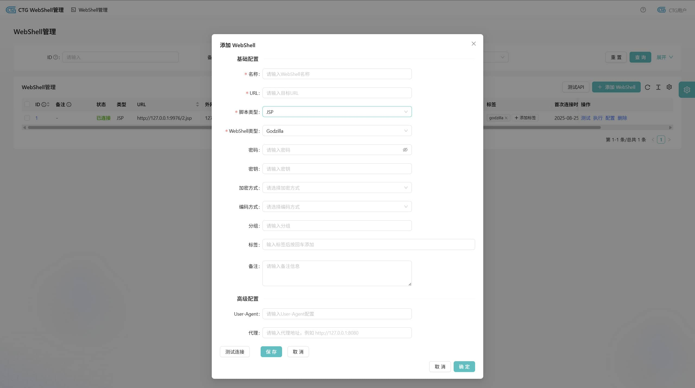
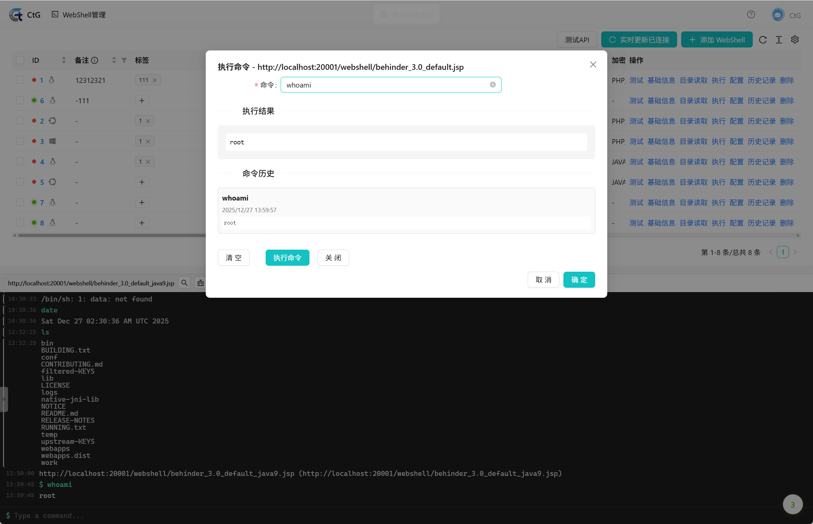

<div align="center">
  
  <p>👻CtG 是一款基于 Web 的 Shell 管理器。</p>
</div>

## WebShell

### 管理页面


### 创建修改



### 命令执行



## 部署

```bash
docker compose up
```

访问 http://localhost:8000/

## 联系方式

<div align="center">
  
  <p>谢谢你的关注~  </p>
</div>

## TODO

- [ ] Godzilla/Behinder 其余格式的支持（目前只测试Gozilla默认JSP）
- [ ] 文件管理支持
- [ ] ...

## 参考项目

+ [xiecat/wsm](https://github.com/xiecat/wsm) [@Go0p](https://github.com/Go0p)
+ [veo/Vshell](https://github.com/veo)
+ [Rubby2001/Rshell](https://github.com/Rubby2001/Rshell---A-Cross-Platform-C2)

## 免责申明

本工具仅供合法的渗透测试以及爱好者参考学习，请勿用于非法用途，否则自行承担相关责任。